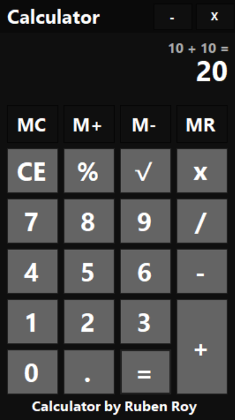

# 🖩 Calculator 

A basic and user-friendly calculator built with C# in Visual Studio 2022, using Windows Forms on the .NET Framework.


<p align="center">
  
</p>

---

## 🌟 Features

- Basic arithmetic operations: addition, subtraction, multiplication, division.
- Memory functions: `M+`, `M-`, `MC`, `MR`.
- Comprehensive error handling: avoids crashes due to invalid operations.
- Clean and intuitive user interface.

## 📦 Download

You can download the latest executable of the Calculator from the [releases page](https://github.com/DarkTwentyFive/Calculator/releases).


## 🚀 Getting Started

### Prerequisites

- [Visual Studio 2022](https://visualstudio.microsoft.com/vs/)
- .NET Framework (usually comes bundled with Visual Studio).

### Installation

1. Clone the repository:
   ```bash
   git clone https://github.com/DarkTwentyFive/Calculator.git
    ```
2. Open the .sln file in Visual Studio 2022.

3. Press F5 to build and run the application.

# 🛠️ Development
If you wish to tweak the application:

Make sure you have the latest version of the .NET Framework SDK.
Navigate to the desired form or class within the solution explorer.
Implement your changes and debug using the built-in debugger in Visual Studio.

# 📝 License
This project is licensed under the MIT License. See the [LICENSE](LICENSE) file for details.
